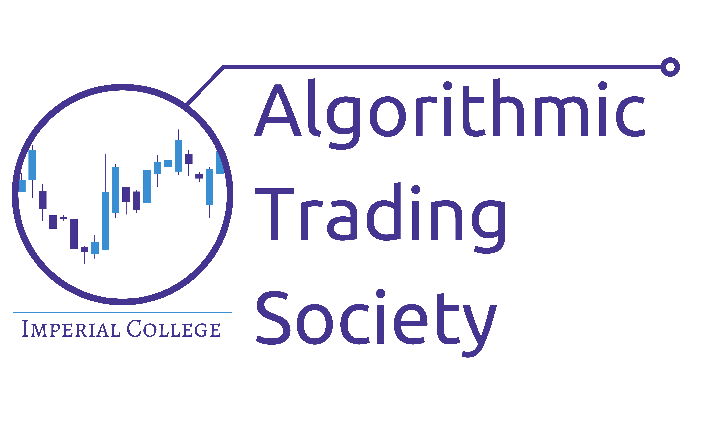
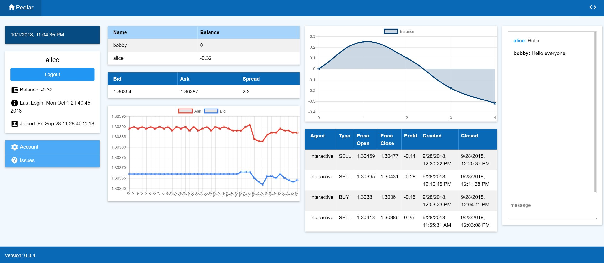

# :chart_with_upwards_trend: AlgoSoc-Sessions

	
	
	

# Pedlar 2.0 Demo's

[Pedlar 2.0 Repo](https://github.com/algotradingsoc/Demo-notebooks)

## Content

- data:
  - Contains all the csvs used for backtesting.
- intro_agents:
  - Contains 3 simple intro agents demonstrating key pedlar functionality.
- agents:
  - Contains the agents produced during the sessions. Frequently redesigned with improvements and optimisations.

---

## Next Steps:

### For agents:
- [x] Decision tree based agent
- [ ] Linear model based agent
- [ ] NN based agent
- [ ] RNN based agent
- [ ] RL based agent

### For finding parameters:
- [x] Explicit search
- [x] Random search
- [ ] Grid search
- [ ] Gradient-based search
- [ ] Evolution-based search
- [ ] Sharpe Optimisation

### Combining multiple signals & agents:
- [x] Ensemble of agents
- [ ] K-Armed bandits

### Risk Control:
- [ ] Time dependent behaviour (e.g. varying behaviour around market open/close)
- [ ] Real time statistics
- [ ] Add post-analysis of trades made.

---

# About us:

### [Algo soc website](http://www.algosoc.com)

### [Algo soc slack](https://algosoc.slack.com)

## Our trading platform Pedlar:

[Imperial pedlar server](http://icats.doc.ic.ac.uk) &rightarrow; (requires access to Imperial Wifi Network)

#### You can contact us at: <algo.trade@imperial.ac.uk>

